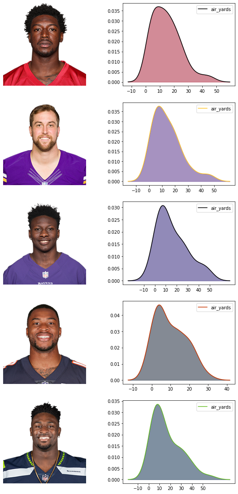

# nflfastpy

This is a Python package for easily loading NFL play by play data via [nflfastR](https://github.com/mrcaseb/nflfastR)

# Installing nflfastpy

nflfastpy is available on PyPI 

```
$ pip install nflfastpy
```

nflfastpy supports Python 3.6+
<br><br>


# Usage 
### Loading Play by Play Data

Play by play data is available going back to 1999.

```Python
import nflfastpy

df = nflfastpy.load_pbp_data(year=2020)
```
<br>

### Loading Roster Data

```Python
roster_df = nflfastpy.load_roster_data()
```

### Joining Roster Data and Team Logo Data with Play by Play Data
To join roster data with play by play data, player id's in the play by play data must be converted to the old GSIS ID. A helper function in `nflfastpy.utils` accomplishes this.

```Python
import nflfastpy
from nflfastpy.utils import convert_to_gsis_id
from matplotlib import pyplot as plt
import pandas as pd
import seaborn as sns
import requests

df = nflfastpy.load_pbp_data(year=2020)

roster_df = nflfastpy.load_roster_data()

team_logo_df = nflfastpy.load_team_logo_data()

roster_df = roster_df.loc[roster_df['team.season'] == 2019]

air_yards_df = df.loc[df['pass_attempt'] == 1, ['receiver_player_id', 'posteam', 'air_yards']]

air_yards_df = air_yards_df.loc[air_yards_df['receiver_player_id'].notnull()]

air_yards_df['gsis_id'] = air_yards_df['receiver_player_id'].apply(convert_to_gsis_id)

#grabbing the top 5 air yards
top_5_air_yards = air_yards_df.groupby('gsis_id')['air_yards'].sum().sort_values(ascending=False)[:10].index.unique()

air_yards_df = air_yards_df.loc[air_yards_df['gsis_id'].isin(top_5_air_yards)]

fig, axes = plt.subplots(5, 2, figsize=(10, 20))

for i, row in enumerate(axes):
    
    ax1, ax2 = row[0], row[1]
    
    player_gsis_id = top_10_air_yards[i]
    player_df = air_yards_df.loc[air_yards_df['gsis_id'] == player_gsis_id]
    player_roster_data = roster_df.loc[roster_df['teamPlayers.gsisId'] == player_gsis_id]
    team_logo_data = team_logo_df.loc[team_logo_df['team_abbr'] == player_df['posteam'].values[0]]
    player_headshot = player_roster_data['teamPlayers.headshot_url'].values[0]
    team_color_1 = team_logo_data['team_color'].values[0]
    team_color_2 = team_logo_data['team_color2'].values[0]
    
    a = plt.imread(player_headshot)
    ax1.imshow(a)
    ax1.axis('off')
    sns.kdeplot(player_df['air_yards'], color=team_color_2, ax=ax2)
    x = ax2.get_lines()[0].get_xydata()[:, 0]
    y = ax2.get_lines()[0].get_xydata()[:, 1]
    ax2.set_xticks(range(-10, 60, 10))
    ax2.fill_between(x, y, color=team_color_1, alpha=0.5)

plt.show();
```



